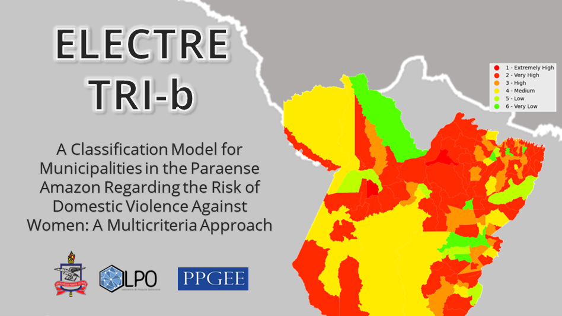
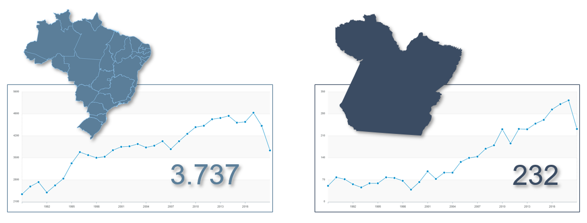
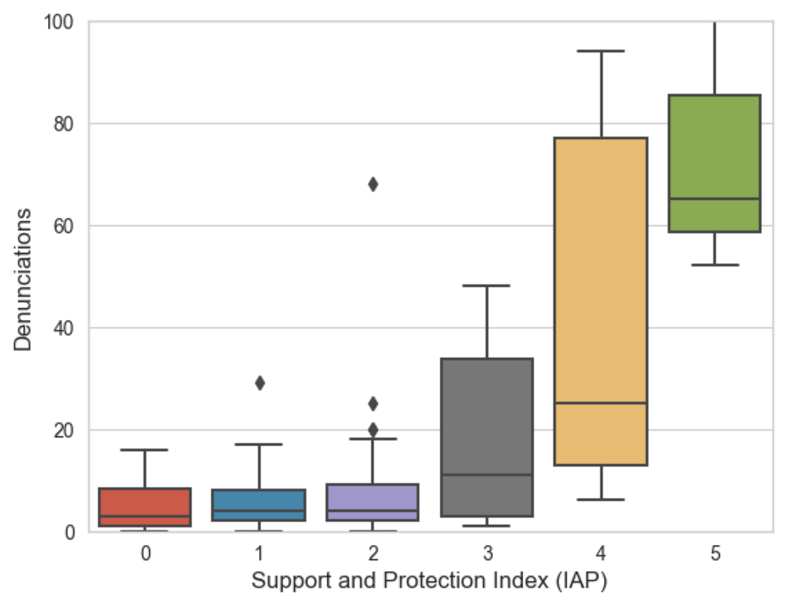
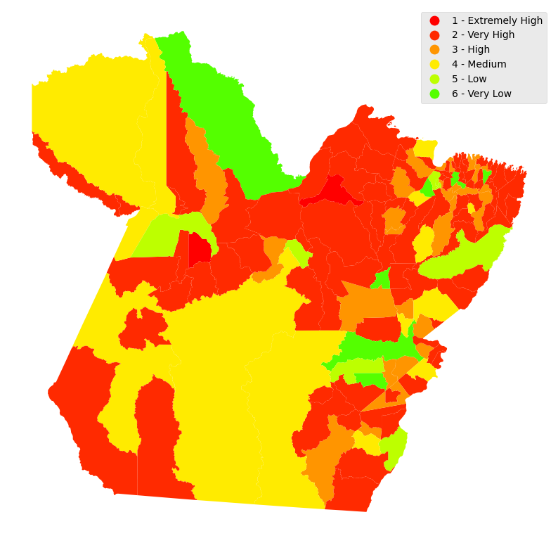

# A Classification Model for Municipalities in the Paraense Amazon Regarding the Risk of Domestic Violence Against Women: A Multicriteria Approach:

<!---Esses são exemplos. Veja https://shields.io para outras pessoas ou para personalizar este conjunto de escudos. Você pode querer incluir dependências, status do projeto e informações de licença aqui--->




<div style="text-align: justify">   Domestic violence against women (DVAW) is a serious violation of the rights to life, health, and physical integrity. Its occurrence generates costs, internal and external, to both the individual offender and the victim. In view of these facts, the state has its responsibility increased when the costs are directly linked to the lack of management strategies that collaborate with the confrontation of violence. This project aims to develop a multi-criteria decision analysis model (MCDA) to classify municipalities in Pará with regard to the propensity of the crime of DVAW, based on the mapping of assistance and protection equipments, as well as socioeconomic indicators of each municipality. The results present an excellent performance after sensitivity testing, ensuring the effectiveness of the model and thus establishing itself as a support tool in the development of different policies for each region, such as investments in infrastructure of protection networks, judicial equipping and definition of economic and social strategies.
<p>
</p>

## 💻 Prerequisites

Before you begin, check that you have met the following requirements:

- You have installed the latest version of `<Python / Pandas / PyDecision / GeoPandas>`
- Operating System: `<Windows / Linux / Mac>`.


## 🚀 Installing the required libraries

### Download the latest version for your Operation System.
```
https://www.python.org/downloads/ 
```
Installing from PyPI

### Installing pandas
Download the latest version at https://pandas.pydata.org/
```python
pip install pandas
```

### Installing Requests
The latest version at https://pypi.org/project/requests/
```python
pip install requests
```

### Installing PyDecision
The latest version at https://pypi.org/project/pyDecision/
```python
pip install pyDecision
```

### Installing GeoPandas
The latest version at https://geopandas.org/en/stable/
```python
pip install geopandas
```

# INTRODUCTION
<p align="center">
    
    </p>
<p align="center">
    <em>"Fig 1. Total number of homicides of women in 2019 in Brazil and in the state of Pará."</em>
</p>    
In 2023 it will be three decades since the United Nations signed the Vienna Declaration at a conference in which the horizons of understanding and the scope of what was considered human rights were significantly expanded. Thus, violence against women (VAW), privately or in public spaces and in any respect, came to be regarded by the international community as incompatible with human dignity, and women’s human rights were declared to be inalienable, integral, and indivisible from the set of universal human rights [1]. Despite this, the recent COVID-19 pandemic showed that there is still 8 much to be done in preventing, combating and punishing cases of violence against women, as well as in assisting and protecting victims, since the increase in cases was 10 seen as a deleterious consequence of domestic confinement [2], [3]. Violence against women (VAW) can be defined as any act of gender-based violence that results in or is likely to result in physical, sexual or mental harm or suffering to women [4], [3]. This type of violence causes physical, material and mental harm to the victims, forcing the application of specific laws to repress it, such as, for example, in Brazil, the Federal Law No. 11.340/2006 [5], known as Maria da Penha Law, which created mechanisms to curb domestic and family violence against women, ensuring the creation of specific courts and punishments for aggressors in order to eradicate and prevent this type of rights violation whose end point, sometimes, is the victim’s death. Thus, the Atlas of Violence, organized by the Institute for Applied Economic Research (IPEA, in Portuguese) [6], 2019, points out that in Brazil there has been a growth in cases of homicides of women in recent years, reaching a peak of 4,936 cases in 2017, reducing in subsequent years until reaching 3,737 cases. Reducing the scale of the scope of the data, in the state of Pará, this reduction occurred only in 2019 (Fig 1). 
According to the Brazilian Institute of Geography and Statistics (IBGE, in Portuguese) (2021), the state of Pará has 144 municipalities, divided into immediate geographic regions, which are grouped into seven intermediate geographic regions.
According to the Atlas of Violence, the state occupies the fourth position in homicides of women [6].</div>

`In the next steps we will demonstrate how the model works`

## Import the names of the municipalities in the surveyed region:

`url` is the API request string. It follows the criteria defined in the API documentation that can be accessed through this link.

`res` is the variable that receives the API data (`json`).

`df_munic` is the main dataframe where the data obtained from the API will be structured.

<div style="padding: 15px; border: 1px solid transparent; border-color: transparent; margin-bottom: 20px; border-radius: 4px; color: #3c763d; background-color: #dff0d8; border-color: #d6e9c6;">
At the end of this step, a table with the code and name of the municipality will be presented.
</div>

```python
import pandas as pd
import requests as rq

url = 'https://servicodados.ibge.gov.br/api/v1/localidades/estados/pa/municipios'
   
res = rq.request("GET", url)

#Creates a data frame with the Municipalities column.
if res.status_code == 200:
    df_munic = pd.DataFrame({'id': [], 'localidade': []})
    
    for id, munic in enumerate(res.json()):
        df_munic.loc[id] = [str(munic['id'])[:6], munic['nome']]

```
### 1.1. - Setting up the URL for getting the data and defining the main dataframe

With the help of the IBGE API documentation, we can obtain the code of the indicators we want to select. For the case study of the project, we selected the following indicators:

    90201: 'Has_specialized_delegations',
    90335: 'Executes specific_programs_actions
    90358: 'Has specific_legislation_violence_against_women
    90626:'Has rights_or_policies_for_women
    90640:'Has_human_rights_protection_programs_for_women_victims


```python
indicators = ['90201','90335','90358','90626','90640']

url = "https://servicodados.ibge.gov.br/api/v1/pesquisas/1/periodos/2019/indicadores/"

#Adiciona os indicadores na url
for i, ind in enumerate(indicators):
    if i != (len(indicators)-1):
        url += ind + '|'
    else:
        url += ind + '/'
        

def urlResultadosPorMunicipos(url, df):
    url += 'resultados/'    

    for i, row in df_munic.iterrows():
        if i != (len(df)-1):
            url += row.id + '|'
        else:
            url += row.id + '/'
    
    return url

url = urlResultadosPorMunicipos(url, df_munic)

res = rq.request("GET", url)

res.json()

```

## 2. Obtaining data from the protection and assistance network of each municipality.

```python
if res.status_code == 200:
    
    #Scrolls through the json and inserts the data into the main dataframe for each selected indicator.
    for indicador in res.json():
        df_temp = pd.DataFrame(indicador['res'])
        df_temp = df_temp[['localidade', 'res']]
        df_temp.rename(columns = {'localidade':'id', 'res': indicador['id']}, inplace = True)
        
        #It replaces the words "Yes" and "No" with binary information 1 and 0.
        df_temp[indicador['id']] = df_temp[indicador['id']].map(lambda x: 1 if x['2019']  == 'Sim' else 0)
        df_munic = pd.merge(df_munic, df_temp, on="id")

#It defines the number of women's protection and assistance mechanisms and aggregates the data to the main dataframe.
df_munic['Rede_de_Protecao_assistencia'] = df_munic[90201] + df_munic[90335] + df_munic[90358] + df_munic[90626] + df_munic[90640]
df_munic = df_munic[['id', 'localidade', 'Rede_de_Protecao_assistencia']]
```

### Obtaining values for the Human Development Index (HDI)

```python

url = "https://servicodados.ibge.gov.br/api/v1/pesquisas/37/periodos/2010/indicadores/30255/"

url = urlResultadosPorMunicipos(url, df_munic)
        
res = rq.request("GET", url)

# correction of missing values
x = res.json()
x[0]['res'][73]['res']['2010'] = '0'
x

df_temp = pd.json_normalize(x[0]['res'])
df_temp.rename(columns={'localidade': 'id', 'res.2010': 'IDH'}, inplace=True)
df_temp = df_temp[['id', 'IDH']]
df_munic = pd.merge(df_munic, df_temp, on='id')

```

### Getting Per Capita Income

```python
url = "https://servicodados.ibge.gov.br/api/v1/pesquisas/38/periodos/2019/indicadores/47001/"

url = urlResultadosPorMunicipos(url, df_munic)   
res = rq.request("GET", url)
df_temp = pd.json_normalize(res.json()[0]['res'])
df_temp.rename(columns={'localidade': 'id', 'res.2019': 'PIB'}, inplace=True)
df_temp = df_temp[['id', 'PIB']]
df_munic = pd.merge(df_munic, df_temp, on='id')
```
### Getting GINI Index

```python
url = "https://servicodados.ibge.gov.br/api/v1/pesquisas/36/periodos/2003/indicadores/30252/"

url = urlResultadosPorMunicipos(url, df_munic)
        
res = rq.request("GET", url)
# correction of missing values
x = res.json()
x[0]['res'].append({'localidade': '150475', 'res': {'2003': '0.00'}, 'notas': {'2003': None}})

df_temp = pd.json_normalize(x[0]['res'])
df_temp.rename(columns={'localidade': 'id', 'res.2003': 'GINI'}, inplace=True)
df_temp = df_temp[['id', 'GINI']]
df_munic = pd.merge(df_munic, df_temp, on='id', how='left')
```

### Turning Columns into Numeric Types

```python
df_munic['Rede_de_Protecao_assistencia'] = pd.to_numeric(df_munic['Rede_de_Protecao_assistencia'])
df_munic['IDH'] = pd.to_numeric(df_munic['IDH'])
df_munic['PIB'] = pd.to_numeric(df_munic['PIB'])
df_munic['GINI'] = pd.to_numeric(df_munic['GINI'])
```
# Data normalization

Normalization consists in recalculating the values of the columns for intervals between 0 and 1. This procedure is necessary so that different scales do not affect the accuracy of the model. In this case, only the columns that have values with scales outside the range 0 and 1 will be recalculated.
The calculation is done by dividing the value of the alternative by the sum of the column values:


```python
columns = df_munic[['Rede_de_Protecao_assistencia', 'IDH', 'PIB', 'GINI']]

for i in columns:
    if i in ['IDH', 'PIB', 'GINI']:
        mx = df_munic[[i]].max()[0]
        mn = df_munic[[i]].min()[0]
        df_munic[[i]] = (df_munic[[i]] - mn) / (mx - mn)
```
# Application of the Multicriteria Method ELECTRE Tri-b
### Classification parameter settings
```python
#require Libraries
import numpy as np

from pyDecision_master.pyDecision.algorithm import electre_tri_b

     #IP       #IDH      #PIB      #GINI
Q = [0.1,      0.10,      0.1,      0.1]
P = [0.2,      0.20,      0.2,      0.2]
V = [1.0,      1.00,      1.0,      1.0]
W = [0.5,      1.00,      0.3,      1.0]

B = [[0.1,       0.48,      0.01,     0.37],
     [0.2,       0.57,      0.03,     0.68],
     [0.3,       0.62,      0.04,     0.70],
     [0.4,       0.68,      0.08,     0.72],
     [0.5,       0.69,      0.50,     0.85]]
```

### Obtaining number of denunciations per municipality
#### Source: Ministry of Women, Family and Human Rights (https://www.gov.br/mdh/pt-br/acesso-a-informacao/dados-abertos/ligue180)

```python
columns = df_munic[['Rede_de_Protecao_assistencia', 'IDH', 'PIB', 'GINI']]
dataset = pd.DataFrame(columns).to_numpy()

# Call Electre Tri-B Function
res = electre_tri_b(dataset, W , Q , P , V , B, cut_level = 0.75, verbose = False, rule = 'pc', graph = True)

#classification
classification = res[0]

#[classification, concordance_matrix, disconcordance_matrix, fuzzy_matrix]
d = []
for i in range(0, len(res[0])):
     d.append({'ID': 'a' + str(i+1), 'Class': str(res[0][i])})
     #print('x' + str(i+1)+": " + " Class " + str(classification[i]))

xd = pd.DataFrame(d)
```

### Aggregating Classification Columns

```python
df_munic['idx'] = xd['ID']
df_munic['classe'] = xd['Class']
```

### Adding to the list of complaints

```python
dd = pd.read_json('casos_violencia_por_municipio.json')
df_munic['denuncias'] = dd['casos']
```
### Showing visualization between public equipment index and the number of reports

```python
import seaborn as sns 
import matplotlib.pyplot as plt

data = df_munic

import seaborn as sns
sns.set_style("whitegrid")
 
# depict visualization
gfg = sns.boxplot(x="Rede_de_Protecao_assistencia", y="denuncias",
                  data=data)

gfg.set_ylim(0, 100)
gfg.set(xlabel ="Support and Protection Index (IAP)", ylabel = "Denunciations")
```

<p align="center">
    
    </p>
<p align="center">
    <em>"Fig 5. Public facilities versus denunciations in municipalities"</em>
</p>    
    
### GeoPandas library for mapping Para's municipalities

#### Reading the file with the state geometry

```python
import geopandas as gpd

gdf_munic = gpd.read_file('munics.geojson')

#gdf_munic.head()
for value in gdf_munic['id']:
    gdf_munic['id'].replace(to_replace=value, value=value[:6], regex=True,inplace=True)


df_teste = pd.merge(df_munic, gdf_munic, on='id', how='left')

df_teste = df_teste[['id', 'localidade', 'geometry']]

df_teste['classe'] = classification
```

### Graphic Plotting

```python
clusdict={5: '1 - Extremely High', 4: '2 - Very High', 3: '3 - High', 2: '4 - Medium', 1: '5 - Low', 0: '6 - Very Low' }
df_teste['legenda'] = df_teste['classe'].map(clusdict)
df_teste['classe'] = classification

gpd_teste = gpd.GeoDataFrame(df_teste)

ax = gpd_teste.plot(column='legenda', categorical=True, legend=True, legend_kwds={'loc': 'upper right'}, figsize=(10,10), cmap='prism')

def replace_legend_items(legend, mapping):
    for txt in legend.texts:
        for k,v in mapping.items():
            if txt.get_text() == str(k):
                txt.set_text(v)

replace_legend_items(ax.get_legend(), clusdict)

ax.set_axis_off()
```
<p align="center">
    
    </p>
<p align="center">
    <em>"Fig 4. Final ranking of the municipalities."</em>
</p>    
    
# Conclusion
<div style="text-align: justify"> This article presents a multicriteria model developed to classify the municipalities of the State of Par ́a on the propensity of the existence of a favorable or not context for domestic violence against women; the dimensions used for this classification were the political, social, economic, and demographic scenarios. The ELECTRE TRI-B was used as a means to reach the objective. The model developed and the research findings represent an important step for the elaboration, execution, and control of public policies better coordinated with the reality of each municipality in Par ́a; based on these data, institutions of public power andsociety can intervene in a proactive and preventive way regarding DVAW.The long-term goal is to create a favorable and safe context so that: i) the localsociety rejects violence against women, increasing the cost of its practice and reducingits usefulness to the aggressor; ii) there are means for women, especially thosevictimized by violence, to have ways of generating their own income, thus having thepossibility of abandoning an abusive relationship; and iii) the woman victim, with allthese positive reinforcements, will report the aggression suffered or in progress.The non-uniformity of the origins of the data that formed the basis of this analysisor that were used as criteria for such can be seen as a hindrance to this work; however,focused on the objectives, the authors were able to connect the information and datawhen carrying out their systematization, which subsidized the analysis. In this sense, itis concluded that the model proposed here is applicable, replicable and highly efficient </div>

# References
1. Bunch C, Reilly N. Women’s rights as human rights: twenty-five years on.
International Human Rights of Women. 2019; p. 21–38.
2. Dekel B, Abrahams N. ‘I will rather be killed by corona than by him. . . ’:
Experiences of abused women seeking shelter during South Africa’s COVID-19
lockdown. PLoS one. 2021;16(10):e0259275.
3. S ́anchez OR, Vale DB, Rodrigues L, Surita FG. Violence against women during
the COVID-19 pandemic: An integrative review. International Journal of
Gynecology & Obstetrics. 2020;151(2):180–187.
4. Vieira PR, Garcia LP, Maciel ELN. Isolamento social e o aumento da violˆencia
dom ́estica: o que isso nos revela? Revista brasileira de epidemiologia. 2020;23.
5. DA SILVA LIL, ROUSSEFF D, et al. Lei nº 11.340, de 7 de agosto de 2006. 2006;.
6. Alves PP, Lima RSd, Marques D, Silva FABd, Lunelli IC, Rodrigues RI, et al.
Atlas da violˆencia 2021. 2021;.
7. Martins JC. Determinantes da violˆencia dom ́estica contra a mulher no Brasil.
2020;.
8. Tauchen HV, Witte AD, Long SK. Domestic violence: A nonrandom affair.
International Economic Review. 1991; p. 491–511.
9. ABNT ABdNT. NBR 9284. Rio de Janeiro. 1986;.
10. Gurgel AM, MOTA C, PEREIRA D. Gest ̃ao da Seguran ̧ca P ́ublica: Um Modelo
de Classifica ̧c ̃ao Multicrit ́erio Combinado a Sistemas de Informa ̧c ̃oes Geogr ́aficas.
In: CONGRESO LATINO IBERO-AMERICANO DE INVESTIGACI  ́ON
OPERATIVA; 2012.
11. SANTOS BTdH, et al. Classifica ̧c ̃ao dos munic ́ıpios pernambucanos com rela ̧c ̃ao
`a seguran ̧ca p ́ublica: uma abordagem multicrit ́erio. Universidade Federal de
Pernambuco; 2021.
12. OLIVEIRA BLd. Seguran ̧ca p ́ublica: classifica ̧c ̃ao das cidades da Para ́ıba quanto
a propensao a criminalidade. 2019;.
13. de Oliveira BM, de Lucena KDT, Gomes RGS, Coˆelho HFC, de Toledo Vianna
RP, Meira RMB. Distribui ̧c ̃ao espacial da violˆencia dom ́estica contra a mulher.
Journal of Human Growth and Development. 2019;29(1):102–109.
14. da Silva Costa SW, Costa FAR, da Rocha Seruffo MC. The use of Multicriteria
Decision-Making Methods for the implementation of equipment to protect women
victims of violence: a case study in the Amazon. Research, Society and
Development. 2022;11(4):e37011427409–e37011427409.
15. Arias IFB, Bermudez JMM, G ́omez FME. TOPSIS with a Neutrosophic
Approach for a Study of Strategies to Confront the Crime of Feminicide in
Ecuador. vol. 37. Infinite Study; 2020.
16. Biswas P, Das K, Das Chatterjee N. Analysis of eve-teasing potential zones using
geospatial technologies and AHP: a study in Midnapore town, West Bengal, India.
GeoJournal. 2021;86(3):1043–1072.
17. Eastman J, Jiang H. Fuzzy measures in multi-criteria evaluation. United States
Department of Agriculture Forest Service General Technical Report RM. 1996; p.
527–534.
18. Roy B. Multicriteria methodology for decision aiding. vol. 12. Springer Science &
Business Media; 1996.
19. TRI WYE. Aspects m ́ethodologiques et guide d’utilisation. Document du
LAMSADE;74.
20. de Barros GMM, Pereira V, Roboredo MC. ELECTRE tree: a machine learning
approach to infer ELECTRE Tri-B parameters. Data Technologies and
Applications. 2021;55(4):586–608.
21. Leite FMC, Mascarello KC, Almeida APSC, F ́avero JL, Santos ASd, Silva ICMd,
et al. An ́alise da tendência da mortalidade feminina por agress ̃ao no Brasil,
estados e regi ̃oes. Ciˆencia & Sa ́ude Coletiva. 2017;22:2971–2978.


## 🤝 Colaborators

We thank you all for your valuable contributions to this project:

<table>
  <tr>
    <td align="center">
      <a href="#">
        <br>
        <sub>
          <b>João L. De Souza</b>
        </sub>
      </a>
    </td>
    <td align="center">
      <a href="#">
        <br>
        <sub>
          <b>Saulo William</b>
        </sub>
      </a>
    </td>
    <td align="center">
      <a href="#">
        <br>
        <sub>
          <b>Alana Miranda</b>
        </sub>
      </a>
    </td>
    <td align="center">
      <a href="#">
        <br>
        <sub>
          <b>Fernando Costa</b>
        </sub>
      </a>
    </td>
    <td align="center">
      <a href="#">
        <br>
        <sub>
          <b>Marcos Seruffo</b>
        </sub>
      </a>
    </td>
    
  </tr>
</table>

## 📝 License

<a rel="license" href="http://creativecommons.org/licenses/by/4.0/"></a><br /><span xmlns:dct="http://purl.org/dc/terms/" property="dct:title">A classification model for municipalities in the paraense Amazon regarding the risk of domestic violence against women: A multicriteria approach.</span> de <a xmlns:cc="http://creativecommons.org/ns#" href="https://github.com/jlucioDev/woman_victm_of_domestic_violence_ELECTRE_APP" property="cc:attributionName" rel="cc:attributionURL">João Lúcio de Souza Júnior</a> está licenciado com uma Licença <a rel="license" href="http://creativecommons.org/licenses/by/4.0/">Creative Commons - Atribuição 4.0 Internacional</a>.<br />Baseado no trabalho disponível em <a xmlns:dct="http://purl.org/dc/terms/" href="https://www.overleaf.com/read/jhxdnsxbsyfc" rel="dct:source">https://www.overleaf.com/read/jhxdnsxbsyfc</a>.


