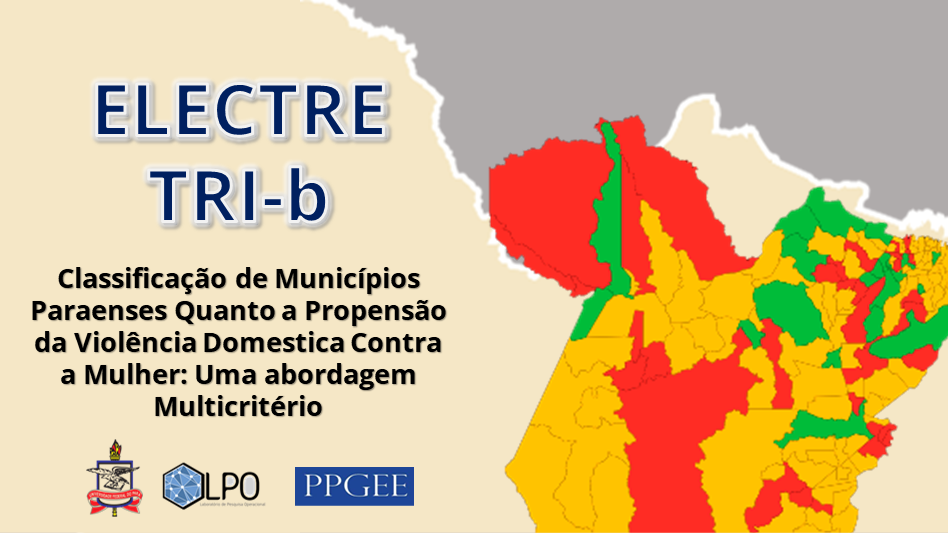

# Classificação de municípios quanto a propenção de VDCM (Violência Doméstica Contra a Mulher)

<!---Esses são exemplos. Veja https://shields.io para outras pessoas ou para personalizar este conjunto de escudos. Você pode querer incluir dependências, status do projeto e informações de licença aqui--->




> <b>RESUMO</b>: A violência doméstica contra a mulher (VDCM) é uma grave violação de direitos à vida, à saúde e à integridade física. Sua ocorrência gera custos, internos e externos, tanto ao indivíduo infrator quanto à vítima. Diante desses fatos, o estado tem sua responsabilidade potencializada, quando os custos estão diretamente ligados a falta de estratégias de gestão que colaborem com o enfrentamento da violência.Este projeto tem como intuito a elaboração de um modelo de análise de decisão multicritério (MCDA) para classificar municípios paraenses com relação à propensão do crime de VDCM, com base no mapeamento dos equipamentos de assistência e proteção, assim como, indicadores socioeconômicos de cada município. Os resultados apresentam um ótimo desempenho após teste de sensibilidade, garantindo a eficácia do modelo e estabelecendo-se assim, como um instrumento de apoio no desenvolvimento de diferentes políticas para cada região, tais como investimentos em infraestrutura de redes de proteção, aparelhamento judicial e definição de estratégias econômicas e sociais.

### 1. Introdução

A violência doméstica é uma das violações de direitos reconhecida pela Conferência das Nações Unidas sobre Direitos Humanos em Viena (1993) e está entre as principais preocupações da humanidade e ademais, as perdas causadas em decorrência de sua vitimização. O tema ganhou ainda maior relevância diante do aumento de casos durante a propagação da COVID-19, como consequência deletéria do confinamento doméstico. 
A violência contra a mulher pode ser definida como qualquer ato de violência baseada no gênero, que resulta ou tem probabilidade de resultar em prejuízo ou sofrimento físico, sexual ou mental às mulheres, Vieira (2020).
  No Brasil, a lei 11.340/2006, conhecida como Lei Maria da Penha, cria mecanismos para coibir a violência doméstica e familiar contra a mulher, assegurando a criação de juizados específicos e punições aos agressores no intuito de erradicar e prevenir esse tipo de violação de direitos.
	Segundo IBGE (2021), o estado do Pará possui 144 municípios, divididos em 21 regiões geográficas imediatas, as quais são agrupadas em sete regiões geográficas intermediárias. De acordo com Atlas da Violência, 3.737 mulheres foram assassinadas no Brasil no ano de 2019. O Pará ocupa a quarta posição em homicídios de mulheres, Cerqueira (2021).


## 💻 Pré-requisitos

Antes de começar, verifique se você atendeu aos seguintes requisitos:

- Você instalou a versão mais recente de `<Python / Pandas / PyDecision>`
- Você tem uma máquina `<Windows / Linux / Mac>`. 


## 🚀 Instando as bibliotecas necessárias 

Para instalar o Python, siga estas etapas:

Linux e macOS:

```
<comando_de_instalação>
```

Windows:

```
<comando_de_instalação>
```

## 🤝 Colaboradores

Agradecemos às seguintes pessoas que contribuíram para este projeto:

<table>
  <tr>
    <td align="center">
      <a href="#">
        <br>
        <sub>
          <b>João Lúcio</b>
        </sub>
      </a>
    </td>
    <td align="center">
      <a href="#">
        <br>
        <sub>
          <b>Alana Miranda</b>
        </sub>
      </a>
    </td>
    <td align="center">
      <a href="#">
        <br>
        <sub>
          <b>Saulo William</b>
        </sub>
      </a>
    </td>
    <td align="center">
      <a href="#">
        <br>
        <sub>
          <b>Marcos Seruffo</b>
        </sub>
      </a>
    </td>
  </tr>
</table>

## 📝 Licença

Esse projeto está sob licença. Veja o arquivo [LICENÇA](LICENSE.md) para mais detalhes.